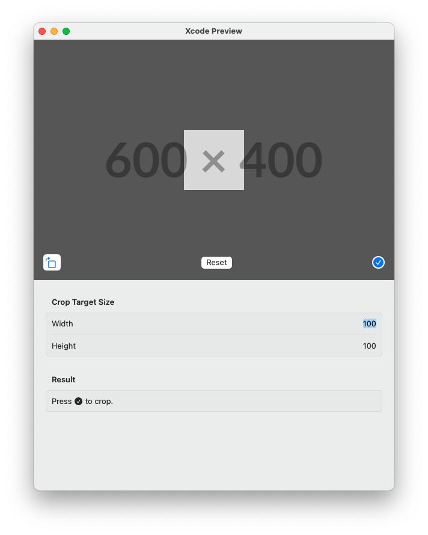

# CropImage

A simple SwiftUI view where user can move and resize an image to a pre-defined size.

Supports iOS 14.0 and above, or macOS Ventura 13.0 and above.

- Supports both iOS and macOS
- Use `ImageRenderer` to render the cropped image, when possible
- Very lightweight
- (Optionally) bring your own crop UI

<picture>
  <source media="(prefers-color-scheme: dark)" srcset="./Sources/CropImage/Documentation.docc/Resources/macos~dark.png">
  
</picture>

## License

[MIT](./LICENSE)
